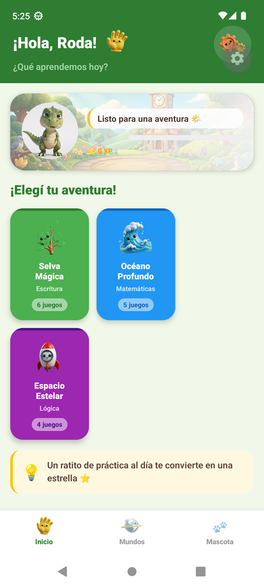
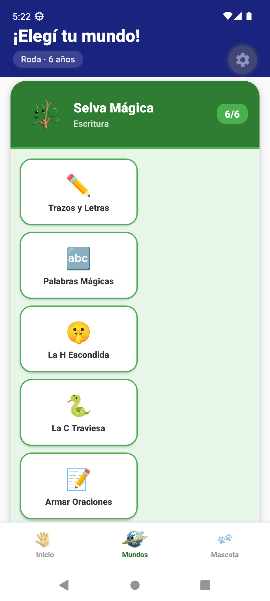
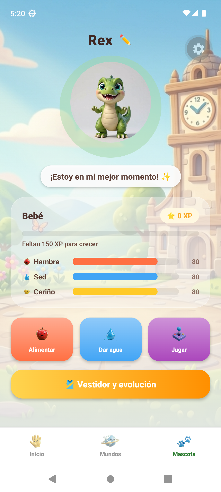
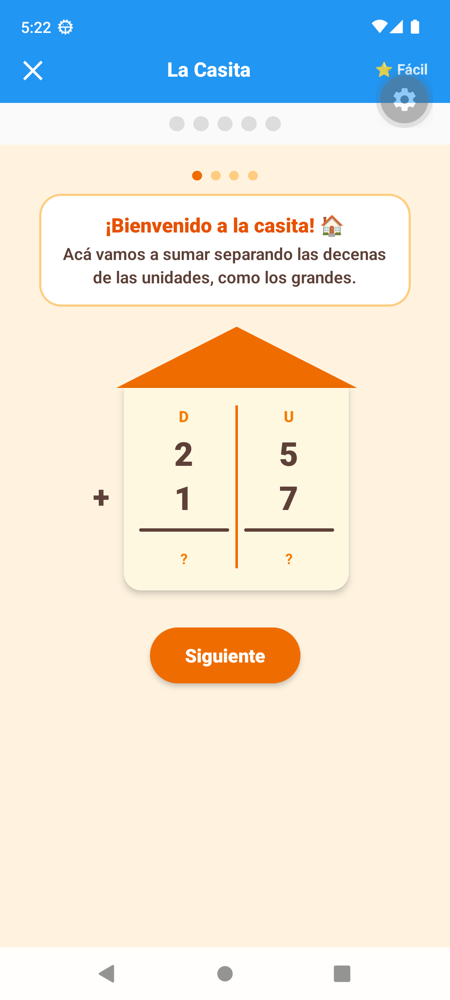
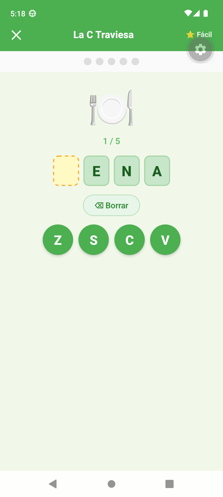

# Sierrita 🐾

Sierrita es una aplicación educativa para chicos en edad preescolar y primaria (4 a 6 años), pensada para practicar matemática, lectoescritura y lógica jugando — mientras cuidan a una mascota virtual propia. Funciona **completamente offline**: no se conecta a internet, no recolecta datos personales ni usa analíticas de terceros; todo el progreso se guarda localmente en el dispositivo.

## Capturas de pantalla

| Inicio                                 | Mundos                                                    | Mascota                                  |
| -------------------------------------- | --------------------------------------------------------- | ---------------------------------------- |
|  |  |  |

| La Casita (sumas con acarreo)                      | La C Traviesa (ortografía)                                 |
| -------------------------------------------------- | ---------------------------------------------------------- |
|  |  |

## Índice

- [Capturas de pantalla](#capturas-de-pantalla)
- [¿Qué es Sierrita?](#qué-es-sierrita)
- [Funcionalidades](#funcionalidades)
- [Stack técnico](#stack-técnico)
- [Arquitectura](#arquitectura)
- [Decisiones técnicas](#decisiones-técnicas)
- [Estructura del repositorio](#estructura-del-repositorio)
- [Cómo correr el proyecto](#cómo-correr-el-proyecto)
- [Testing](#testing)
- [CI](#ci)

## ¿Qué es Sierrita?

La app organiza el contenido educativo en **3 mundos**, cada uno con varios minijuegos cortos (5-6 rondas cada uno):

| Mundo              | Materia    | Juegos                                                                                                                   |
| ------------------ | ---------- | ------------------------------------------------------------------------------------------------------------------------ |
| 🌿 Selva Mágica    | Escritura  | Trazos y Letras, Palabras Mágicas, **La H Escondida**, **La C Traviesa**, Armar Oraciones, Letra Cursiva                 |
| 🌊 Océano Profundo | Matemática | Contar Pececitos, Sumas y Restas, **La Casita** (sumas/restas con acarreo y préstamo), Centenas y Decenas, Mayor y Menor |
| 🚀 Espacio Estelar | Lógica     | Secuencias, Memoria Estelar, Clasificar, Laberinto                                                                       |

Además, cada perfil de chico tiene una **mascota virtual** (hambre/sed/cariño, que evoluciona con la experiencia (XP) ganada jugando), y hay un **panel de padres** protegido por PIN con estadísticas de progreso y exportación a PDF.

## Funcionalidades

- **Perfiles múltiples por dispositivo**, con edad configurable que determina qué juegos están desbloqueados.
- **Dificultad adaptativa por juego**: cada juego sube o baja de nivel (1/2/3) según los aciertos/errores consecutivos del chico, no según un puntaje fijo.
- **Mascota virtual** con necesidades que decaen con el tiempo (hambre, sed, cariño), etapas de evolución y video-animaciones según especie/ánimo.
- **Refuerzo por voz**: cada consigna y cada corrección se narra por texto-a-voz en español, pensado para chicos que todavía no leen fluido.
- **Ayudas manipulativas**: por ejemplo, en "La Casita" hay palitos arrastrables en pantalla para contar, y el acarreo/préstamo se visualiza con un tachado + flecha sobre el número que cambia (no solo un cartel de texto).
- **Reportes para padres**: estadísticas por juego/mundo, exportables a PDF, sin salir nunca del dispositivo.
- **100% offline y privado**: sin cuentas, sin red, sin tracking — ver [`PRIVACY_POLICY.md`](./PRIVACY_POLICY.md).

## Stack técnico

| Área                 | Tecnología                                                                                            |
| -------------------- | ----------------------------------------------------------------------------------------------------- |
| Framework            | [Expo](https://expo.dev) (SDK 56) + React Native 0.85, New Architecture habilitada                    |
| Lenguaje             | TypeScript                                                                                            |
| Monorepo             | [Nx](https://nx.dev) 22                                                                               |
| Gestor de paquetes   | Yarn 4 (Berry), workspaces                                                                            |
| UI / Design system   | [Tamagui](https://tamagui.dev)                                                                        |
| Navegación           | React Navigation (native-stack + bottom-tabs)                                                         |
| Animaciones / gestos | react-native-reanimated 4, react-native-gesture-handler (arrastre real de los palitos en "La Casita") |
| Gráficos             | react-native-skia (trazo de letras con detección de acierto por punto)                                |
| Persistencia         | expo-sqlite (SQLite local, sin backend)                                                               |
| Audio                | expo-audio (efectos), expo-speech (texto-a-voz), expo-haptics                                         |
| Video                | expo-video (animaciones de la mascota)                                                                |
| PDF                  | expo-print + expo-sharing (reportes para padres)                                                      |
| Testing              | Jest + @testing-library/react-native                                                                  |
| Lint / formato       | ESLint (flat config) + Prettier                                                                       |
| CI                   | GitHub Actions (`format:check` → `lint` + `test` + `typecheck`, todo vía Nx)                          |

## Arquitectura

El repo es un **monorepo Nx** con una sola app (`apps/mobile`, el cliente Expo/React Native) y varias librerías de dominio bajo `libs/`, cada una publicando solo `src/index.ts` como superficie pública:

```
apps/mobile          → la app en sí: pantallas, navegación, componentes visuales
libs/ui               → design system (tokens Tamagui, tema, componentes compartidos)
libs/profiles         → tipos de perfil de chico
libs/pet               → lógica de la mascota (necesidades, evolución, ánimo, XP)
libs/adaptive          → motor de dificultad adaptativa
libs/games             → catálogo de juegos por mundo + contenido (bancos de palabras, letras)
libs/audio             → sonido, voz y haptics
libs/parents           → autenticación por PIN, configuración, textos para el panel de padres
libs/storage           → repositorios SQLite (une todo lo anterior a persistencia)
libs/pdf               → generación de reportes en PDF
```

Las dependencias entre libs están **restringidas explícitamente por ESLint** (`@nx/enforce-module-boundaries` en `eslint.config.mjs`), en capas:

```
scope:ui          → no depende de nada interno
scope:domain-core → pet, profiles, adaptive, games, audio, parents (solo entre sí)
scope:infra        → storage (puede usar domain-core)
scope:feature       → pdf (puede usar domain-core + infra)
scope:app           → apps/mobile (puede usar todo)
```

Esto evita, por ejemplo, que `libs/pet` termine importando algo de `libs/storage` o de la app — la lógica de dominio queda aislada y testeable sin React Native de por medio.

### El patrón de juego

Cada minijuego sigue la misma convención de carpeta-por-componente (`Juego.tsx` + `.styles.ts` + `.test.tsx` + `components/` + `logic/`), y comparte:

- **`useGameRound`** (`apps/mobile/src/screens/worlds/games/shared/useGameRound.ts`): el hook que orquesta el ciclo de una ronda (mostrar resultado → esperar → siguiente ronda o fin de juego) para _todos_ los juegos, evitando duplicar esa coreografía en cada uno.
- **`GAME_IDS` / `GameConfig`** (`libs/games`): cada juego se registra con un `id`, título, emoji, edad mínima y una función `params(dificultad)` que decide sus parámetros según el nivel adaptativo actual — así un mismo componente (ej. `WordsGame`) puede alimentar varios juegos distintos ("Palabras Mágicas", "La H Escondida", "La C Traviesa") con solo cambiar la config.
- **`GameScreen`**: pantalla genérica que resuelve `gameId` → componente + config, y conecta el resultado de cada ronda con `useAdaptiveDifficulty` y el guardado en SQLite.

## Decisiones técnicas

- **Monorepo Nx con libs por dominio, no por capa técnica.** En vez de un solo `src/` gigante en la app, cada concepto de negocio (mascota, dificultad adaptativa, catálogo de juegos, perfiles) es su propia librería con límites de dependencia forzados por lint. Esto hace posible testear, por ejemplo, toda la lógica de evolución de la mascota sin renderizar nada de React Native.
- **SQLite local en vez de un backend.** No hay servidor: todo el estado (perfiles, progreso, sesiones de juego, configuración de padres) vive en `expo-sqlite` en el dispositivo. Es una decisión de producto (privacidad infantil, uso offline en el aula o el auto) tanto como técnica.
- **Dificultad adaptativa por rachas, no por puntaje acumulado** (`libs/adaptive`): sube de nivel a los 3 aciertos seguidos, baja a los 2 errores seguidos (`ADAPTIVE_CONFIG` en `libs/adaptive/src/types.ts`). Reacciona rápido a cómo le está yendo al chico _ahora_, no a un promedio histórico.
- **Un componente de juego, varios juegos registrados.** En vez de crear una pantalla nueva por cada variante de un mismo mecanismo (ver "La H Escondida" / "La C Traviesa", que reutilizan `WordsGame` con distinta config), se prefiere parametrizar y registrar múltiples entradas en el catálogo — mismo patrón que ya usaba `HundredsGame` con sus 3 modos.
- **Arrastre real, no simulado, para las ayudas manipulativas.** El componente de palitos para contar en "La Casita" usa gestos reales (`react-native-gesture-handler` + `react-native-reanimated`) con un fallback de toque, en vez de limitarse a tocar para sumar/restar — buscando que la ayuda visual se sienta como los materiales físicos que ya usan en el aula.
- **Sin recolección de datos.** Ninguna librería de analíticas, ninguna llamada de red en uso normal. Ver [`PRIVACY_POLICY.md`](./PRIVACY_POLICY.md).

## Estructura del repositorio

```
apps/
  mobile/                 # App Expo/React Native
    src/
      screens/
        worlds/
          games/
            jungle/        # Selva Mágica: TracingGame, WordsGame, SentencesGame, CursiveGame
            ocean/          # Océano Profundo: CountingGame, SumsGame, CasitaGame, HundredsGame, CompareGame
            space/          # Espacio Estelar: PatternsGame, MemoryGame, ClassifyGame, MazeGame
            shared/         # useGameRound y utilidades comunes a todos los juegos
        pet/                # Pantalla de la mascota
        parents/            # Panel de padres (PIN, estadísticas, export PDF)
libs/
  ui/ profiles/ pet/ adaptive/ games/ audio/ parents/ storage/ pdf/
docs/
  user-stories/           # Historias de usuario de features grandes (ej. La Casita)
  screenshots/            # Capturas usadas en este README
store-assets/             # Capturas y assets para las tiendas de apps
```

## Cómo correr el proyecto

```sh
# instalar dependencias
yarn install

# levantar en Android (requiere un emulador corriendo o un dispositivo conectado)
yarn nx run @org/mobile:android
# o, equivalente:
cd apps/mobile && yarn android

# levantar en iOS
cd apps/mobile && yarn ios
```

Cualquier tarea (build, lint, test, typecheck) se corre a través de Nx:

```sh
yarn nx run-many -t lint test typecheck
yarn nx test @org/mobile          # solo la app
yarn nx test games                 # solo una lib
yarn nx affected -t test           # solo lo que cambió respecto a main
```

## Testing

Jest + `@testing-library/react-native` en toda la app y las libs, con foco en testear **comportamiento observable** (qué ve/puede tocar el chico) más que implementación interna. Algunos patrones que se repiten en el repo:

- `jest.useFakeTimers()` para controlar los delays entre rondas (`useGameRound`) sin esperas reales.
- Mocks a nivel de paquete para módulos nativos que no corren en Jest (`@sierrita/audio`, `expo-image`, `Switch`), definidos una sola vez en `apps/mobile/src/test-setup.ts`.
- Tests de regresión con los números/palabras exactos reportados en bugs reales (ver `Casita.test.tsx`, `wordData.spec.ts`) en vez de solo casos genéricos.

## CI

GitHub Actions corre en cada push a `main` y en cada PR (`.github/workflows/ci.yml`):

```sh
yarn nx format:check --base="remotes/origin/main"
yarn nx run-many -t lint test typecheck
```

---

Hecho con Nx + Expo. Licencia y términos: ver [`PRIVACY_POLICY.md`](./PRIVACY_POLICY.md).
